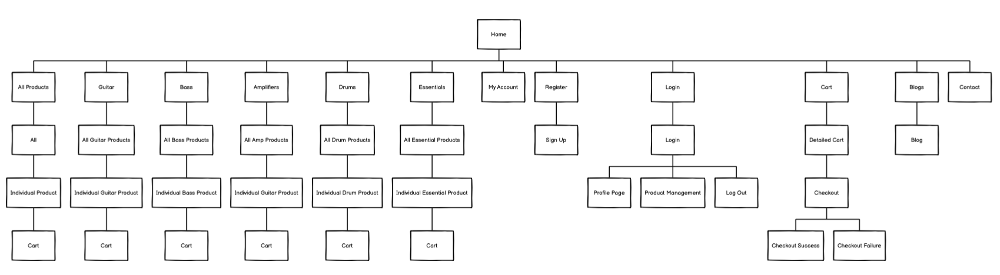

# **Sound Haven**


[View the live website here](https://sound-haven.herokuapp.com/)

</br>  

Welcome to Sound Haven. 

Sound Haven is an e-commerce site that sells instruments of all different capacities, including guitar, drums, amplififers and essential accessories. 

It includes authetication mechanisms making sure that users with certain permissions are able to view appropriate aspects of the website based on their heirarchy. 

It also includes Stripe payments, allowing users to safely purchase their items and include personal details pertaining to delivery and card information. 

This site was built in line with Code Institute's Milestone Project 4 guidelines, including understanding of full-stack website development. Utilising HTML, CSS, Javascript, Python Django, relational database management, and stripe payments.

Additional libraries needed, are listed in the requirements.txt file. 

<br/>  

## **Table of Contents**   
1. [UX Development Planes](https://github.com/DPHamdev/mp4-sound-haven#ux-development-plane)   
   A. [Strategy Plane](https://github.com/DPHamdev/mp4-sound-haven#a-strategy-plane) 
      - [Project Goals, User Goals, and Site Owner Goals](https://github.com/DPHamdev/mp4-sound-haven#project-goals)   
      - [User Stories](https://github.com/DPHamdev/mp4-sound-haven#user-goals)   

   B. [Scope Plane](https://github.com/DPHamdev/mp4-sound-haven#b-scope-plane)  
   C. [Structure Plane](https://github.com/DPHamdev/mp4-sound-haven#c-structure-plane)  
   D. [Skeleton Plane (Wireframes)](https://github.com/DPHamdev/mp4-sound-haven#d-skeleton-plane)  
2. [Database Design](https://github.com/DPHamdev/mp4-sound-haven#database-design)  
3. [Features](https://github.com/DPHamdev/mp4-sound-haven#features)   
   A. [General Design Features](https://github.com/DPHamdev/mp4-sound-haven#a-general-design-features)   
   B. [Page Features](https://github.com/DPHamdev/mp4-sound-haven#b-page-features)  
   C. [Features to be Implemented in The Future](https://github.com/DPHamdev/mp4-sound-haven#c-features-to-be-implemented-in-the-future)
4. [Testing](https://github.com/DPHamdev/mp4-sound-haven#testing)    
   [Go to TESTING.md](https://github.com/dissyulina/shoesandmore/blob/main/TESTING.md#shoes-and-more---testing)
5. [Issues and Bugs](https://github.com/DPHamdev/mp4-sound-haven#issues-and-bugs)  
6. [Technology Used](https://github.com/DPHamdev/mp4-sound-haven#technology-used)  
   A. [Main Languanges](https://github.com/DPHamdev/mp4-sound-haven#a-main-language)  
   B. [Libraries and Frameworks](https://github.com/DPHamdev/mp4-sound-haven#b-libraries-and-frameworks)  
   C. [Packages / Dependencies](https://github.com/DPHamdev/mp4-sound-haven#c-packages--dependecies-installed)  
   D. [Database, Payment Service, and Cloud Storage](https://github.com/DPHamdev/mp4-sound-haven#d-database-management)  
   E [Tools and Programs](https://github.com/DPHamdev/mp4-sound-haven#e-tools-and-programs)  
7. [Deployment](https://github.com/DPHamdev/mp4-sound-haven#deployment)  
   A. [How To Use This Project](https://github.com/DPHamdev/mp4-sound-haven#a-how-to-use-this-project)  
   B. [Deployment to Heroku](https://github.com/DPHamdev/mp4-sound-haven#b-deployment-to-heroku)   
   C. [AWS Bucket Creation](https://github.com/DPHamdev/mp4-sound-haven#c-aws-bucket-creation)  
   D. [Connect Django to AWS Bucket](https://github.com/DPHamdev/mp4-sound-haven#d-connect-django-to-aws-bucket)   
8. [Credits](https://github.com/DPHamdev/mp4-sound-haven#credits)  
   A. [Code](https://github.com/DPHamdev/mp4-sound-haven#a-code)  
   B. [Images](https://github.com/DPHamdev/mp4-sound-haven#b-images)  
   C. [Contents](https://github.com/DPHamdev/mp4-sound-haven#c-content)  
9. [Acknowledgements](https://github.com/DPHamdev/mp4-sound-haven#acknowledgements)   

------


<br/>  

## **UX DEVELOPMENT PLANE**   
### **A. Strategy Plane**  
#### **Project Goals**   
The main objective for this project is to create an e-commerce website that functionally works, visually appealing to the user with a good user experience, whilst being intuitive to a new user whilst navigating. 

It gives users the ability to perform common place features of an e-commerce website, with account functionality and purchasing functionality.  

#### **User Goals**  

A user wants:
-A website that is easy to navigate, clear and concise in design with the ability to purchase their items successfully, with confirmation of their purchases made. 

Target audience:
-Musicians 

#### **Site Owner Goals**  
The owner of the website wants: 
-To generate revenue through the sale of their stock. 
-Manage products available to users which they stock. 


#### **User Stories** 
As a customer I want to:  
   1. Find out what items the site has on sale.    
   2. Search for (a) product(s).   
   3. Want to see what items are highly rated and best sellers.   
   4. Be able to view all products, as well as their individual pages, as well as navigate through categories easily.  
   5. Sort products by rating, product name, price.
   6. See what items I have in my cart.    
   7. Update my shopping cart with varying quantities, whether it's removal or addition.  
   8. Complete my order by secure checkout.  
   9. Trust that my personal information is safe.  
   10. Ability to view order confirmations after purchase.  
   11. Receive email confirmation after purchase.  
   12. Navigate easily through the site with clear navigational tools, such as navbars and footers.  
   13. Register for an account.     

As a registered user, I want to:
   1. Have the same access and more than an unregistered user. 
   2. Log in and Out easily.   
   3. Recover passwords.  
   4. Receive email confirmations/verification once registered.  
   5. Have a personalised profile, with account info and previous order history.  

As an admin/superuser, I want to:
   1. Add product(s).  
   2. Edit and update product(s).  
   3. Delete product(s).  

<br/>  

### **B. Scope Plane**  
A scope plane was designed and thought of after user abilities were defined. 

#### **Functional Requirements**   
An unregistered user can:  
- Sign up to the site by providing their username, email, and password.    
- View products, with sort capabilites.  
- Search through all products.  
- View individual product detail pages.  
- Add products to cart.  
- Update cart.  
- Checkout with safe and secure payment.  
- Receive email confirmation of transaction.    

A registered user can:  
- Have all the functionality that an unregistered user can do.   
- Log in to their own profile using username/passwords/email.  
- Update personal information on their profile page.  
- View previous orders.    

A superuser can:
- Have all functionalities as a registered user.  
- Add product(s) to the site.  
- Edit or update product(s).  
- Delete product(s).  

<br/>  

### **C. Structure Plane**  
The website is using a Hierarchial Structrue to allow the user to view the site easily. This was created with Balsamiq Wire Frames.

    

<br/>  

### **D. Skeleton Plane**  
Wireframes were created using Balsamiq Wire Frames.  

- [Wireframe for Home page](wireframe/indexwireframe.png) 
- [Wireframe for Products page](wireframe/productwireframe.png)  
- [Wireframe for Individual Product page](wireframe/productdetailwireframe.png)  
- [Wireframe for Shopping Bag page](wireframe/cartwireframe.png)  
- [Wireframe for Checkout page](wireframe/checkoutwireframe.png)  
- [Wireframe for Profile page](wireframe/profilewireframe.png)
- [Wireframe for Contact page](wireframe/contactwireframe.png)

<br/>  

#### **Color Scheme**  
The overall colour scheme was adapted from the Boutique Ado tutorial. 
Clear and concise use of just black and white, with hints of off white used in an overlay capacity creates a professional and un cluttered style throughout the website. 

#### **Typography**  
All of the fonts were sourced from [Google Fonts](https://fonts.google.com).   
- Main font: Rajdhani   
   Rajdhani was used as it's a bold and clear font with easy to read characters regardless of size.    


<br/>  

## **DATABASE DESIGN**    

The database was used via SQLite during development on GitHub, but using deployment, it was then using Heroku's Postgres dyno. 

- **Category model**   
   - Name field: the name used for database purposes.  
   - Friendly_name field: the name used for display.  
   
- **Product model**   
   - Product ID: Individual identification for each product.  
   - Category field: the category of the product, a foreign key from the Category model.    
   - Name field: the name of the product, a required field.  
   - Price: the price of the product, a required field.  
   - Rating: the rating of the product. 
   - Image: the image of the product.  
   - Image URL: A smaller thumbnail image, linked to the original site where the .Json file was collected from.
   - Units Sold: Amount of units sold, updated as products are purchased. 

- **User model**    
   - Information storage utilising Django's authentication system. Using username, email and password. 

- **Order model**  
   - Stores all information related to a successfully placed order.  
   - Order_number field: a unique order number generated automatically using UUID.  
   - User_profile field: the user that ordered, a foreign key from the UserProfile model (if the user is registered).  
   - Full_name field: the full name of the buyer.  
   - Email field: the email address of the buyer.  
   - Phone_number: the phone number of the buyer.  
   - Street_address1: the first line of street address of the buyer.  
   - Street_address2: the second line of the street address of the buyer.  
   - Town_or_city: the town or city name of the buyer.  
   - Postcode: the postcode of the buyer.  
   - Country: the county where the buyer resides.
   - Country: the country of the buyer.  
   - Date: the date of purchase.  
   - Delivery_cost: the delivery cost of the transaction.  
   - Order_total: the total price of the order (the total quantity times individual product price).  
   - Grand_total: the order_total + delivery_cost.  
   - Original_bag: a JSON object of the products and sizes that were in the bag.  
   - Stripe_pid: a payment intent id from the stripe for a successful order.  

- **OrderLineItem model**  
   - Stores order details of a product that has been purchased.  
   - Product field: the product ordered, a foreign key from the Product model.  
   - Order field: the order number for this product ordered, a foreign key from the Order model.  
   - Quantity field: the quantity of the product ordered.  
   - Lineitem_total field: the quantity times the individual product price.    

- **UserProfile model**   
   - Stores user's address information for registered user.  
   - User field: the user itself, a foreign key from the User model.  
   - Default_phone_number field: the phone number of the user.  
   - Default_street_address1 field: the first line of the street address of the user.  
   - Default_street_address2 field: the second line of the street address of the user.  
   - Default_town_or_city field: the town or city name of the user.  
   - Default_postcode field: the postcode of the user.  
   - Default_country field: the country of the user.    
 

<br/>  

## **FEATURES**  
### **A. General Design Features**  
- **Fully responsive** - 
The website is responsive and in appropriate ratios on all screen sizes. 

- **Navbar**   
      


   - This navbar is clean and sticks to the top of the browser window so that the user can alway easily navigate. Using a brand logo in it, reminds the user of the website they're on. Bold use of menu options means that users can easily identify where they want to go next. 
   - The navbar collapses down to a hamburger menu on smaller screens to make it more responsive on smaller screen widths, meaning a more recognisable user experience.
   - A search bar included means the user can navigate through products from wherever they currently are on the website. 
   - Profile authentication occurs on the My Account tab, depending on permissions, various options will display.  

- **Footer**  
    
   The Footer again aligns with the top of the page and the navbar, by using the same colour scheme, it means the user is already somewhat accustom to using the navigation tools. 
   It includes, categories links, social media links, account links and a logo. 
  

- **Toast message**   
Toast messages on the top of the website, are activated when a user performs an action such as updating cart, logging in, logging out, email confirmations. 
It's a more attractive user experience and very attractive to the eye, lending itself to a professional image. 
  


   


### **B. Page Features**  
#### **1. Home Page**  
[See the image of the Homepage here](mp4testing/images/heroimage.png)   
The Home page includes a hero image, including navigation to all products through a button nested amongst the image. 

It also includes a best sellers carousel which displays the top 8 best selling products listed on the site.

Above the footer, there is a brand selector which allows the user to select a list of products which match the brand they've selected. 

#### **2. Products Page**  
[See the image of Products page here](mp4testing/images/productssortratingup.png)   
The Products page lists all the products depending on the way in which the user decides to sort them. 

Each product is nested in their own card, displaying a snapshot of the details needed for the user to make an informed decision as to whether they would like to see the products individual page. 

#### **3. Individual Product Page**  
[See the image of Individual Product page here](mp4testing/images/productdetail.png)  
On the products individual page, their is more information listed to the user, depending on their permissions. 

An enlarged image of the product is included, as well as a description, price and quantity selector should they wish to add the product to their cart. 

The page also includes navigation buttons, leading the user to adding the items to their cart, or back to the products page. 

If a superuser is logged in, they'll have the option to edit or delete the product. 


#### **4. Cart Page**  
[See the image of Cart page here](mp4testing/images/cartoverview.png)  
The cart page includes a nested box which allows the user to update/remove the products they have currently in their cart. 

It allows them to navigate through to their checkout page.

#### **6. Checkout Page**  
[See the image of Checkout page here](mp4testing/images/checkout.png)  
The Checkout page, includes an a brief overview of the products selected, as well as the user information needed to complete their order. 

#### **7. Checkout Success Page**   
[See the image of Checkout Sucess page here](mp4testing/images/ordersuccessful.png)  
The Successful order page, means that the user is directed there once their order is complete. Giving them a confirmation of the order details being sent to their inputted email address, as well as an overview of the products once again. 

#### **8. Profile Page**  
[See the image of Profile page - My Information here](mp4testing/images/profile.png)  
The User's profile page displays the user's delivery information and their order history, with the option to navigate to an individual order or to update the delivery information. 

#### **16. Register and Log In Page**  
[See the image of Signup page here](mp4testing/images/signup.png)  
[See the image of Sign In page here](mp4testing/images/signin.png)  
To register the user must give their email of choice as well as confirm the email address, a username and select a password. 

When signing in the user must provide their corresponding username and password, with the option to remember the user and if password is forgotten, they can navigate to a page which allows for it to be recovered. 

#### **17. Product Management / Add Product page (Admin / Superuser only)**  
[See the image of Product Management page here](mp4testing/images/emptyproductmanagement.png)  
Product manage is only available to superusers, it includes all the information required to add a product to the database, once all required fields are completed, the user can add the product. 

#### **18. Edit Product page (Admin / Superuser only)**  
[See the image of Edit Product page here](mp4testing/images/productedit.png)  
Once here, the user can edit the products that they choose, once completed, they can submit and the products will have the amended fields added to the database. 

#### **19. Delete Product Functionality (Admin / Superuser only)**  
A superuser is the only user capable of using this functionality, included on the products page, as well as the individual products page. 

In doing this, the user will remove the product entirely from the page. 


<br/>  

### **Features to be implemented in the future**

1. Stock Management - Basic stock management is implemented by increasing the units sold, however, relational interaction between units sold and total units would be a good way to manage stock levels. 
2. Login/Registration using Oauth, allowing this would be a good way to maintain user's regular interactions with other e-commerce sites and encourage them to login/register. 

<br/>   

## **ISSUES AND BUGS**   
I addressed some bugs whilst creating my site. 

1. Main Carousel 
The Main Carousel was resizing on smaller viewports and maintaining that size as the viewports were changed, this led to an incredibly bad user experience with no room to navigate as the pages became extremely long. 
The Carousel would also have a bug with the default JS found when implementing it, where the images would display, then there would be blank space until you navigate all the way through all the cards. 

I solved these issues by including ```"resize": false``` within the carousel's ```data-flickity``` setting, as well as removing the javascript which was included with the implementation. 

2. AWS Integration 
Static Files
When integrating AWS, after following the tutorial videos listed in Boutqiue Ado tutorial videos, I was able to retrieve files from the GitHub repository, however it wouldn't implement them on deployment. 

In order for this to be resolved, I had to change the policy on my bucket to include a PutObject:
```{
    "Version": "2012-10-17",
    "Id": "Policy1647121670385",
    "Statement": [
        {
            "Sid": "Stmt1647121668758",
            "Effect": "Allow",
            "Principal": "*",
            "Action": [
                "s3:GetObject",
                "s3:PutObject"
            ],
            "Resource": "arn:aws:s3:::sound-haven/*"
        }
    ]
}
```

By doing this, it retrieved the files required, and placed the items into the directories required, a frustrating amount of time was dedicated towards this, which was rectified once looking through the slack channels. 

Media Files
By deploying my files with image names that were spaced out in their names, it meant when the server was trying to recongise the file names, they weren't the same as what was listed, having replaced all the file names on the products.json file, all the media files, reuploaded them to S3, I was still being struck with incorrect images loaded. 
The cache had saved previous file directory URLS, meaning the old file names were still loading, once navigating to the products page on the admin panel and manually changing the products images, only then were the images displaying. 

<br/>  

## **TECHNOLOGY USED**  
### **Main Language**   
   * [HTML5](https://en.wikipedia.org/wiki/HTML5)   
   * [CSS3](https://en.wikipedia.org/wiki/Cascading_Style_Sheets)   
   * [JavaScript](https://en.wikipedia.org/wiki/JavaScript)   
   * [Python](https://en.wikipedia.org/wiki/Python_(programming_language))   

### **Libraries and Frameworks**  
   * [Django](https://flickity.metafizzy.co/)   
      Flickity was used to build carousels on Home Page.   
   * [Django Template](https://jinja.palletsprojects.com)  
      Django Template was used as a templating language for Django to display backend data to HTML.   
   * [Bootstrap 5](https://getbootstrap.com/docs/5.0/getting-started/introduction/)  
      Bootstrap 5 was used throughout the website to help with styling and responsiveness.  
   * [Google Fonts](https://fonts.google.com)  
      Google fonts was used to import the fonts into the html file, and were used on all parts of the site.  
   * [Font Awesome](https://fontawesome.com)  
      Font Awesome was used throughout the website to add icons for aesthetic and UX purposes.   
   * [jQuery 3.6.0](https://jquery.com/)  
      jQuery was used as a JavaScript library to help writing less JavaScript code.  
   * [Flickity](https://flickity.metafizzy.co/)   
      Flickity was used to build carousels on Home Page.    

### **Packages / Dependecies Installed**   
   * [Django Allauth](https://django-allauth.readthedocs.io/en/latest/)  
      Django Allauth was used for user authentication, registration, and account management.  
   * [Django Crispy Form](https://django-crispy-forms.readthedocs.io/en/latest/)   
      Django Crispy Form was used to control the rendering of the forms.  
   * [Django Countries](https://pypi.org/project/django-countries/)   
      Django Countries was used to provide country choices for use with forms and a country field for models.   
   * [Pillow](https://pypi.org/project/Pillow/)  
      Pillow was used to add image processing capabilities.  
   * [Gunicorn](https://gunicorn.org/)  
      Gunicorn was used as Python WSGI HTTP Server for UNIX to support the deployment of Django application.  

### **Database Management**  
   * [SQLite](https://www.sqlite.com/index.html)   
      SQLite was used as a single-file databae in development.   
   * [Heroku Postgres](https://www.heroku.com/postgres)   
      Heroku Postgres database was used in production, as a service based on PostgreSQL provided by Heroku.  

### **Payment Service**  
   * [Stripe](https://stripe.com/en-gb-nl)  
      Stripe was used to process the online payments for the transactions in the website.  

### **Cloud Storage**  
   * [Amazon Web Service S3](https://aws.amazon.com/s3/)
      AWS S3 was used to store all static and media files in production.  

### **Tools and Programs**  
   * [Git](https://git-scm.com)  
      Git was used for version control by utilizing the Gitpod terminal to commit to Git and Push to GitHub.  
   * [GitHub](https://github.com)  
      GitHub was used to store the projects code after being pushed from Git. 
   * [Heroku](https://www.heroku.com)   
      Heroku was used to deploy the website.  

<br/>  

## **DEPLOYMENT**  
The project was originally developed on GitHub, using the GitPod as the IDE, then pushing to GitHub. 

External Deployment of the website was used with Heroku and AWS S3 for file storage, due to GitHub limitations. 

### **A. How To Use This Project**
To use and further develop this project you can either fork or clone the repository.  

#### **Fork GitHub Repository**  
By forking the GitHub repository you can make a copy of the original repository on your GitHub account to view and/or make changes without affecting the original repository, by using the following steps:  

1. Log in to GitHub.  
2. Navigate to the main page of the GitHub Repository that you want to fork.  
3. At the top right of the Repository just below your profile picture, locate the "Fork" button.  
4. You should now have a copy of the original repository in your GitHub account.  
5. Changes made to the forked repository can be merged with the original repository via a pull request.  

#### **Clone Github Repository**  
By cloning a GitHub Repository you can create a local copy on your computer of the remote repository. The developer who clones a repository can synchronize their copy of the codebase with any updates made by fellow developers with push or pull request. Cloning is done by using the following steps:  

1. Log in to GitHub.  
2. Navigate to the main page of the GitHub Repository that you want to clone.  
3. Above the list of files, click the dropdown called "Code".  
4. To clone the repository using HTTPS, under "HTTPS", copy the link.  
5. Open Git Bash.  
6. Change the current working directory to the location where you want the cloned directory to be made.  
7. Type git clone, and then paste the URL you copied in Step 4.  
```$ git clone https://github.com/YOUR-USERNAME/YOUR-REPOSITORY```
8. Press Enter. Your local clone will be created.   
```
$ git clone https://github.com/YOUR-USERNAME/YOUR-REPOSITORY
> Cloning into `CI-Clone`...
> remote: Counting objects: 10, done.
> remote: Compressing objects: 100% (8/8), done.
> remove: Total 10 (delta 1), reused 10 (delta 1)
> Unpacking objects: 100% (10/10), done.
```
Changes made on the local machine (cloned repository) can be pushed to the upstream repository directly if you have a write access for the repository. Otherwise, the changes made in the cloned repository are first pushed to the forked repository, and then a pull request is created.  
Click [Here](https://docs.github.com/en/github/creating-cloning-and-archiving-repositories/cloning-a-repository-from-github/cloning-a-repository) to retrieve pictures for some of the buttons and more detailed explanations of the above process.  

#### **Project Set Up After Forking or Cloning**   
1. Install all dependencies by typing in the CLI ```pip3 install -r requirements.txt```  
2. Create a ```.gitignore``` file and ```env.py``` file in the project's root directory. Add the ```env.py``` file to ```.gitignore```. 
3. Inside the env.py file, enter the project's environment variables:   
   
```
   import os
   
   os.environ.setdefault("SECRET_KEY", <your_secret_key>)
   os.environ.setdefault("DEVELOPMENT", '1')
   os.environ.setdefault("STRIPE_PUBLIC_KEY", <your_key>)
   os.environ.setdefault("STRIPE_SECRET_KEY", <your_key>)
   os.environ.setdefault("STRIPE_WH_SECRET", <your_key>)
```
   
   You can get the keys from:
   - "SECRET_KEY" can be generated using [Django Secret Key Generator](https://miniwebtool.com/django-secret-key-generator/)   
   - "STRIPE_PUBLIC_KEY" and "STRIPE_SECRET_KEY" can be generated by creating a stripe account. The keys are found in 'Developers' Section, under 'API Keys'.  
   - In the Developer Section, under 'Webhooks', add a new endpoint.  "STRIPE_WH_SECRET". On Endpoint URL, enter:  
   ``` https://<your_host_url>/checkout/wh/ ```   
   Select to listen to all events, and create endpoint, and you can view your "STRIPE_WH_SECRET".   

4. Make migrations to setup the inital database operations.  
``` 
   python3 manage.py makemigrations 
   python3 manage.py migrate 
```
5. Load all datas for the database.  
```
   python3 manage.py loaddata categories
   python3 manage.py loaddata subcategories
   python3 manage.py loaddata products
   python3 manage.py loaddata topics
   python3 manage.py loaddata blogs
```
6. Create a super user.
```
   python3 manage.py create superuser
```
   The project should now complete to run and can now be used for development. To run the project, type in the CLI terminal: ```python3 manage.py runserver```     

<br/>  

### **B. Deployment to Heroku**  
This project is deployed on Heroku for production, with all static and media files stored on AWS S3. These are steps to deploy on Heroku:

1. Navigate to Heroku.com, create a new account or login if you already have an account. On the dashboard page, click "Create New App" button. Give the app a name, the name must be unique with hypens between words. Set the region closest to you, and click "Create App".   
2. On the resources tab, provision a new Heroku Postgres database.  
3. Configure variables on Heroku by navigating to Settings, and click on Reveal Config Vars. You may not have all the values yet. Add the others as you progress through the steps.   
   Varables | Key   
   ---| ---   
   AWS_ACCESS_KEY_ID | your_access_key_id_from_AWS   
   AWS_SECRET_ACCESS_KEY | your_secret_access_key_from_AWS  
   DATABASE_URL | your_database_url   
   EMAIL_HOST_PASS | your_app_password_from_your_email   
   EMAIL_HOST_USER | your_email_address  
   SECRET_KEY | your_secret_key 
   STRIPE_PUBLIC_KEY | your_stripe_public_key  
   STRIPE_SECRET_KEY | your_stripe_secret_key  
   USE_AWS | True 

4. If you haven't install it, install dj_database_url and psycopg2.
```
   pip3 install dj_database_url
   pip3 install psycopg2-binary
```
   Note: you don't have to do this if you've installed all dependencies in the requirements.txt file.  
5. Set up a new database for the site by going to the project's settings.py and importing dj_database_url. Comment out the database's default configuration, and replace the default database with a call to dj_database_url.parse and pass it the database URL from Heroku (you can get it from your config variables in your app setting tab)
```
   DATABASES = {
     'default': dj_database_url.parse('YOUR_DATABASE_URL_FROM_HEROKU')
   }
```
6. Run migrations
```
   python3 manage.py migrate
```
7. Import all products, topics (for contact form), and blogs data. I'm using fixtures json files, use therefore the loaddata method.  
```
   python3 manage.py loaddata categories
   python3 manage.py loaddata subcategories
   python3 manage.py loaddata products
   python3 manage.py loaddata topics
   python3 manage.py loaddata blogs
```
8. Set up a new superuser, fill out the username, email address, and password.
```
   python3 manage.py create superuser
```
9. Remove the database config from Heroku and uncomment the original config. Add a conditional statement to define that when the app is running on Heroku. we connect to Postgres, and otherwise, we connect to Sqlite.   
```
   if 'DATABASE_URL' in os.environ:
      DATABASES = {
         'default': dj_database_url.parse(os.environ.get('DATABASE_URL'))
      }
   else:
      DATABASES = {
         'default': {
            'ENGINE': 'django.db.backends.sqlite3',
            'NAME': BASE_DIR / 'db.sqlite3',
         }
      }
```
10. Install gunicorn (if you haven't) which will act as the webserver, and put it on the requirements.txt.   
``` 
   pip3 install gunicorn
   pip3 freeze > requirements.txt
```
   Note: you don't have to do this if you've installed all dependencies in the requirements.txt file.  
11. Create a Procfile, to tell Heroku to create a web dyno, which will run unicorn and serve the Django app.   

   Inside the Procfile:
```
   web: gunicorn shoes_and_more.wsgi:application
```
12. Login to Heroku through CLI, using ```heroku login```. Once logged in, disable the collect static temporarily, so that Heroku won't try to collect static files when it deploys.
```
   heroku config:set DISABLE_COLLECTSTATIC=1 --app mp4-sound-haven
```
   And add the hostname of the Heroku app to allowed hosts in the project's settings.py, and also add localhost so that Gitpod will still work as well:  
```
   ALLOWED_HOSTS = ['sound-haven.herokuapp.com', 'localhost']
```
13. Add, commit, and push to gitpod and then to Heroku. After pushing to gitpod as usual, initialize git remote first:
```
   heroku git:remote -a mp4-sound-haven
```
   Then push to Heroku:
```
   git push heroku main
```
14. Go to the app's dashboard on Heroku and go to Deploy. Connect the app to Github by clicking Github and search for the repository. Click connect. Also enable the automatic deploy by clicking Enable Automatic Deploys, so that everytime we push to github, the code will automatically be deployed to Heroku as well.  
15. Go back to settings.py and replace the secret key setting with the call to get it from the environment, and use empty string as a default. 
```
   SECRET_KEY = os.environ.get('SECRET_KEY', '')
```
   Set debug to be true only if there's a variable called development in the environment.
```
   DEBUG = 'DEVELOPMENT' in os.environ
```

<br/>  

### **C. AWS Bucket Creation**   
All static and media files in this project are stored in [Amazon Web Services S3 bucket](https://aws.amazon.com/) which is a cloud based storage service. You can create your own bucket by following these steps:   
1. Go to [Amazon Web Service website](https://aws.amazon.com/) and click on Create An AWS Account, or login if you already have an account.  
2. Login to your new account, go to AWS Management Console and find service S3. Click on Create Bucket.   
   - Give it a name (I recommend naming your bucket to match the Heroku app name), and choose region closest to you.  
   - In Object Ownership section, choose ACLS enabled. and Bucket Owner Preffered.   
   - Uncheck box 'Block All Public Access'.  
   - Check box 'I acknowledge that the current settings might result in this bucket and the objects within becoming public.'  
   - Click on Create Bucket, and your bucket is created.  
3. Click on your newly created bucket, and navigate to the Properties tab. Scroll down to the bottom until you find Static Website Hosting. Click on Edit, then enable. 
   - Hosting type: choose Host a Static Website   
   - Index document: index.html  
   - Error document: error.html
   - Click on Save Changes.  
4. Navigate to the Permissions tab. Scroll down to the bottom until you find Cross-origin resource sharing (CORS). Click on Edit, and paste in this Cors Configuration below, which is going to set up the required access between the Heroku app and this S3 bucket. Click on Save Changes. 
```
   [
      {
         "AllowedHeaders": [
            "Authorization"
         ],
         "AllowedMethods": [
            "GET"
         ],
         "AllowedOrigins": [
            "*"
         ],
         "ExposeHeaders": []
      }
   ]
```
   Still on the Permissions tab, find Bucket policy, click on Edit, and then go to Policy Generator. 
   - Select Type of Policy: choose S3 Bucket Policy   
   - Effect: choose Allow   
   - Principal: *   
   - Actions: select GetObject, PutObject   
   - Fill in the Amazon Resource Name (ARN), from the Bucket ARN back in the Bucket Policy   
   - Click on the Add Statement and then Generate Policy. Copy the policy and paste in the bucket policy editor.  
   - Add a slash star on to the end of the resource key (because we want to allow access to all resources in this bucket). Click Save.

The resource key should look like this

```  
      "Resource": "arn:aws:s3:::YOUR_BUCKET_NAME/*",  
```
   
   Still on Permissions tab, go to Access Control List (ACL) section, click Edit and enable List for Everyone (public access), and accept the warning box.  

5. With the bucket ready, now we need to create a user to access it through another service called IAM which stands for Identity and Access Management. Go back to the service menu and open IAM.   
   a. Create a group for our user to live in.  
   Click User Groups, and then create a new group with a name you want. I gave the group the name: manage-shoes-and-more. Scroll down to the bottom and click on Create Group.     
   b. Create an access policy giving the group access to the S3 bucket that has been created.  
   - Click on Policy, and then Create Policy. Go to the JSON tab, and then select import managed policy, which will let us import one that AWS has pre-built for full access to S3. Search for S3, then import the AmazonS3FullAccess policy.   
   - Because we only want to allow full access to our new bucket and everything within it, paste the bucket ARN (from the bucket policy page in s3) in the JSON editor.
```
      "Resource": [
         "arn:aws:s3:::YOUR_BUCKET_NAME",
         "arn:aws:s3:::YOUR_BUCKET_NAME/*"
      ]
```
Now click on Next:Tags, then click Next:Review. 
- Give the review policy a name and a description, then click Create Policy. The policy has now been created. 
   
   c. Finally, assign the user to the group so it can use the policy to access all our files.  
- Go to User Groups, and select the group. Go to the Permissions tab, open the Add Permissions dropdown, and click Attach Policies.  
- Select the policy and click Add permissions at the bottom.  
- Create a user to put in the group, by going to the Users page, and clicking Add Users.  
- Set a user name, give them access type: Programmatic access, and then click Next: Permissions.   
- Check on the group that has the policy attached. Click Next: Tags, then click Next: Review, and lastly Create User.     
- Download the csv file and save it.  

<br/>  

### **D. Connect Django to AWS Bucket**   
Note: If you've forked the repository, all of these steps are already done/ written on the files. Make sure you've installed all dependencies in the requirements.txt file, add all the AWS-related Config Vars to Heroku, and remove the DISABLE_COLLECTSTATIC variable from Heroku.   
Here are the steps I took to connect Django to AWS:  
1. Install two new packages: boto3 and django-storages. Freeze them into requirements.txt.   
```
   pip3 install boto3
   pip3 install django-storages 
   pip3 freeze > requirements.txt  
```
2. Add storages to the Installed Apps in settings.py.
3. In settings.py, we need to set cache control, set bucket configurations, set static and media files location, and override static and media URLs in production. We'll only want to do this on Heroku, so add an if statement as well.
```
   if 'USE_AWS' in os.environ:
      # Cache control
      AWS_S3_OBJECT_PARAMETERS = {
         'Expires': 'Thu, 31 Dec 2099 20:00:00 GMT',
         'CacheControl': 'max-age=94608000',
      }
   
      # Bucket Config
      AWS_STORAGE_BUCKET_NAME = 'YOUR_BUCKET_NAME'
      AWS_S3_REGION_NAME = 'YOUR_REGION'
      AWS_ACCESS_KEY_ID = os.environ.get('AWS_ACCESS_KEY_ID')
      AWS_SECRET_ACCESS_KEY = os.environ.get('AWS_SECRET_ACCESS_KEY')
      AWS_S3_CUSTOM_DOMAIN = f'{AWS_STORAGE_BUCKET_NAME}.s3.amazonaws.com'
   
      # Static and media files
      STATICFILES_STORAGE = 'custom_storages.StaticStorage'
      STATICFILES_LOCATION = 'static'
      DEFAULT_FILE_STORAGE = 'custom_storages.MediaStorage'
      MEDIAFILES_LOCATION = 'media' 
   
      # Override static and media URLs in production
      STATIC_URL = f'https://{AWS_S3_CUSTOM_DOMAIN}/{STATICFILES_LOCATION}/'
      MEDIA_URL = f'https://{AWS_S3_CUSTOM_DOMAIN}/{MEDIAFILES_LOCATION}/'
```
   Set the Config Vars on Heroku. On your app's dashboard on Heroku, go to Settings and click Reveal Convig Vars. Set this variables:
   Variables | Value
   --- | ---
   AWS_ACCESS_KEY_ID | your access key id from the csv file that you've downloaded before
   AWS_SECRET_ACCESS_KEY | your secret access key from the csv file that you've downloaded before
   USE_AWS | True    

   Also remove the COLLECTSTATIC variable from the Config Vars.   

4. We then want to tell Django that in production we want to use S3 to store our static files whenever someone runs collectstatic, and that we sent any uploaded images to go there as well.  
   Create a custom_storages.py file in your project's root directory, and inside it, include the Static and Media Storage locations: 
```
   from django.conf import settings
   from storages.backends.s3boto3 import S3Boto3Storage


   class StaticStorage(S3Boto3Storage):
      location = settings.STATICFILES_LOCATION


   class MediaStorage(S3Boto3Storage):
      location = settings.MEDIAFILES_LOCATION
```  

5. Finally, push these changes on Github.
```
   git add .
   git commit -m "Your commit message"
   git push
```  

<br/>


## **CREDITS**   
### **A. Code**  
- The code in Code Institute's video on the Boutique Ado project was used as the main reference point to set up an e-commerce / online store project using HTML, CSS, JS, Python+Django, PostgreSQL database, Stripe, and AWS S3 as storage.  
- Design and ReadMe ideas taken from [shoesandmore](https://github.com/dissyulina/shoesandmore/). The user 'dissyulina', has implemented features which utilised my ideas of displaying a functional website in some capacities. Their ReadME file layout and Deployment is used, as the structure is very clear and concise, as well as the Deployment method being so thorough.
- Bug fix concerning Quantity selectors not being used on large screens, implemented by using [this fix](https://github.com/Code-Institute-Solutions/boutique_ado_v1/commit/de7ad2067ac1b5de37a4cd8b9f4ddf572a4bf6c7)


### **B. Images**  
All products images were sourced from accross free-images source website:
[Pexels](https://www.pexels.com/), [EMD](https://www.emdmusic.com/)
