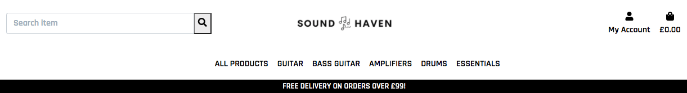
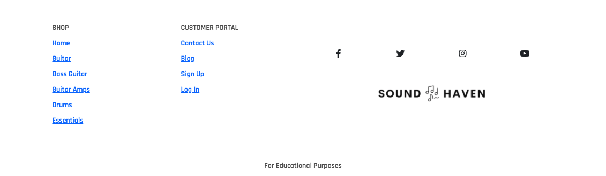

# Testing


This documents accounts for the testing procedures that have taken place in order to demonstrate the functionality of this site. 


## Validator testing

### HTML

https://validator.w3.org/

The HTML error had no errors aside from the validator not recognising the jinja templating language which incurred it to highlight every jinja code. 

Other than that, all other HTML worked soundly. 


### CSS

https://jigsaw.w3.org/css-validator/

The CSS validator came back with zero errors. 


### JS

https://jshint.com/

The JavaScript validator came back with zero errors. 

### Python

http://pep8online.com/

Some errors occured, but these were due to linting errors from imported files. 

Another common issue was ```line too long (91 > 79 characters)```

Such an example as 
```
AUTH_PASSWORD_VALIDATORS = [
   {
      'NAME': 'django.contrib.auth.password_validation.UserAttributeSimilarityValidator',
   },
   {
      'NAME': 'django.contrib.auth.password_validation.MinimumLengthValidator',
   },
   {
      'NAME': 'django.contrib.auth.password_validation.CommonPasswordValidator',
   },
   {
      'NAME': 'django.contrib.auth.password_validation.NumericPasswordValidator',
   },
] 
```

This couldn't be broken down to fit without breaking the password validators, this had to be left in. 

Most errors were formatting to a new line, which has now taken place. 

# Testing

The site has been tested on various window sizes, and they all work accordinly to encourage a pleasant user experiencence with no skewing and images kept in proportional ratios. 

All links work correctly, navigating the user to the appropriate direction, with none returning an error page. 

## Lighthouse

[Lighthouse for Home page](mp4/images/lighthouse/indexlighthouse.png) 
[Lighthouse for Product page](mp4/images/lighthouse/allproductslighthouse.png) 
[Lighthouse for Individual Product page](mp4/images/lighthouse/productdetaillighthouse.png) 
[Lighthouse for Cart page](mp4/images/lighthouse/cartlighthouse.png) 
[Lighthouse for Checkout page](mp4/images/lighthouse/checkoutlighthouse.png) 
[Lighthouse for Checkout Success page](mp4/images/lighthouse/checkoutsuccesslighthouse.png) 
[Lighthouse for Profile page](mp4/images/lighthouse/profilelighthouse.png) 
[Lighthouse for Add Product page](mp4/images/lighthouse/addproductlighthouse.png) 
[Lighthouse for Edit Product page](mp4/images/lighthouse/editproductlighthouse.png) 


# User Stories


1. **Find out what itmes the site has on sale**


2. **Search for (a) product(s).** 


3. **Want to see what items are highly rated and best sellers.**


4. **Be able to view all products, as well as their individual pages, as well as navigate through categories easily.**


5. **Sort products by rating, product name, price.**


6. **See what items I have in my cart**


7. **Update my shopping cart with varying quantities, whether it's removal or addition.**


8. **Complete my order by secure checkout.**


9. **Ability to view order confirmations after purchase.**


10. **Receive email confirmation after purchase.**


11. **Navigate easily through the site with clear navigational tools, such as navbars and footers.**




12. **Register for an account.**


### Registered Users

1. **Log in and Out easily.**


2. **Receive email confirmations/verification once registered.**


3. **Have a personalised profile, with account info and previous order history.**


### Superuser

1. **Add product(s)**


2. **Edit and update product(s)**


3. **Delete product(s)**


